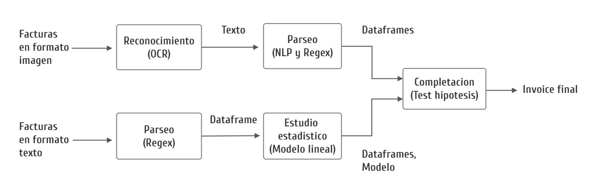

# Documentación

## Introducción

Esta es la documentación de un sistema hecho para la empresa Parlisur con el fin de extraer costos de servicios profesionales para facturas de proveedores. Dado un conjunto de facturas, completa un set de datos de números de factura y costos profesionales provisto por la empresa.

## Instalación

Basta tener el código fuente con las 3 carpetas principales de **facturas_texto**, **facturas_imagen** y **reconocimiento**. Para correr el código se necesita tener instalado Python y las siguientes librerías:

- Numpy, Matplotlib, Pandas

- CV2, PaddleOCR

- Pdf2image

- Sklearn

- Deskew

- Joblib

- Nltk

- Fuzzywuzzy

Además de Cuda con una placa gráfica que lo soporte para correr PadleOCR.

Las imágenes no están descargadas al pesar más de 7gb. Estas pueden descargarse de: https://drive.google.com/drive/folders/1znGiPCeZ2f5A9qb0HeqlfKdiOK2-KtvF.

Las imágenes que pesan más de 60kb van a ./facturas_imagen/reconocimiento/imagenes, mientras que las que pesan menos van a ./facturas_texto/parseo/facturas

Los resultados del reconocimiento de caracteres puede encontrarse en: https://drive.google.com/drive/folders/1MiG_-6MpJDmL6ly-cnsg-daD_ru85CMI?usp=sharing

## Estructura general

La estructura del proyecto es la siguiente:

- En la carpeta de ./facturas_texto está el sistema de procesamiento de todas las facturas en formato texto. Abarca los módulos de **parseo** y **estudio estadístico**. Recibe las facturas en formato texto y extrae el número de factura correspondiente con el costo de servicios profesionales (en un csv). También ajusta y archiva un modelo lineal.

- En la carpeta ./facturas_imagen está el sistema de procesamiento de todas las facturas en formato imagen. Abarca los módulos de **reconocimiento** y **parseo**. Recibe las facturas en formato imagen y extrae el número de factura correspondiente con el costo de servicios profesionales (en un csv).

- El módulo de completación está en ./completacion. Su input son los csv retornados de los sistemas anteriores junto con un archivo .joblib que tiene el modelo ajustado. Llena un csv provisto por la empresa con el número de factura y su costo en servicios profesionales.

## Procesamiento de facturas en formato texto

Lo siguiente documenta el código y sistemas en la carpeta /facturas_texto. Se representa por ./

### Parseo del texto

El sistema es llevado a cabo por el programa ./parseo/parseo.py. 

- **Input**: Facturas en la carpeta ./parseo/facturas. Tienen que ser pdfs cuya información está en formato texto.

- **Output**: Un solo dataframe con columnas almacenando *Número de factura*, *Costo total* y *Costo profesional* respectivamente para cada factura del input. Lo almacena en la carpeta ./modelo.

### Análisis estadístico

Es llevado a cabo por el programa ./modelo/modelo.py.

- **Input**: Un dataframe con columnas almacenando *Número de factura*, *Costo total* y *Costo profesional* respectivamente.

- **Output**: Un archivo modelo.joblib en la carpeta de ./modelo que contiene los siguientes tres objetos:

    - Una regresión por cuantil fiteada al dataframe producido por el parseo de texto. Se almacena como un objeto de sklearn QuantileRegressor(). La predicción de costo profesional dado un valor de costo total puede obtenerse con objeto.predict([valor]).

    - La mediana de servicios profesionales

    - La mediana de servicios profesionales para valores negativos de costo total

## Procesamiento de facturas en formato imagen

Lo siguiente documenta el código y sistemas en la carpeta de facturas_imagen. Se representa la carpeta por ./

### Reconocimiento de caracteres

Es llevado a cabo por el programa ./reconocimiento/imagen_a_texto.py

- **Input**: Facturas en la carpeta ./reconocimiento/imagenes. Tienen que ser pdfs cuya información está en formato texto.

- **Output**: Archivos .joblib en la carpeta de ./reconocimiento/ocr_crudo. Cada uno contiene una lista de python con el procesado de 100 facturas. Cada una se representa en formato ([(Coordenadas texto, texto), ...], path). El primer elemento de la tupla es una lista con las coordenadas de cada bloque de *texto*. La segunda coordenada contiene el path de la factura en ./reconocimiento/imagenes.

### Parseo del texto

Es llevado a cabo por el programa ./parseo/parseo.py

- **Input**: Archivos joblib con el formato del output del sistema de reconocimiento. Se almacenan en la carpeta ./parseo/ocr_crudo.

- **Output**: Un dataframe en formato csv con columnas almacenando *Número de factura*, *Costo total* y *Costo profesional* respectivamente para **cada** archivo del input. Lo almacena en la carpeta ./parseo/dataframes.

## Completación

Lo siguiente documenta el código y sistemas en la carpeta de completación. Se representa la carpeta por ./

El sistema de completación es llevado a cabo por ./completacion.py.

- **Input**: Recibe el csv retornado por el sistema de facturas_texto junto con el modelo ajustado en formato joblib. Se almacena en la carpeta ./modelo. También recibe los csv retornados por el sistema de facturas_imagen en la carpeta de ./dataframes.

- **Output**: Un csv invoice_final_completado.csv en ./ que rellena el dataframe con columnas de *Números de factura* y *Costo en servicios profesionales* provisto por la empresa.

## Cómo correr el sistema completo

./ hace referencia al directorio del proyecto.

1) Descargar las imágenes desde el link https://drive.google.com/drive/folders/1znGiPCeZ2f5A9qb0HeqlfKdiOK2-KtvF. Ubicar las que pesen menos de 60kB en *./facturas_texto/parseo/facturas* y las que pesen más en *./facturas_imagen/reconocimiento/imagenes*

2) Correr *./facturas_texto/parseo/parseo.py* para procesar las facturas en formato texto

3) Correr *./facturas_texto/modelo/modelo.py* para ajustar un modelo al resultado del procesamiento anterior.

4) Correr *./facturas_imagen/reconocimiento/imagen_a_texto.py* para reconocer el texto de todas las facturas en formato imagen. Como tarda tanto tiempo puede descargarse el resultado (se guarda en la carpeta *./facturas_imagen/reconocimiento/ocr_crudo*) del link https://drive.google.com/drive/folders/1MiG_-6MpJDmL6ly-cnsg-daD_ru85CMI?usp=sharing
.

5) Copiar la carpeta *./facturas_imagen/reconocimiento/ocr_crudo* a *./facturas_imagen/parseo*. Luego correr el archivo parseo.py en ese directorio.

6) Copiar la carpeta *./facturas_imagen/dataframes* a *./completacion* y mover los archivos modelo_df.csv y modelo.joblib en *./facturas_texto/modelo* a *./completacion/modelo*. Luego correr *./completacion/completacion.py*

Luego de seguir todos los pasos el archivo *./completacion/invoice_final_completado.csv* contiene el csv completado con los números de facturas provistos por la empresa y su respectivo costo en servicios profesionales.

## Comentarios

La documentación del funcionamiento interno de cada programa está debidamente documentado en su respectivo archivo.

Si bien parece incómodo la separación del sistemas en distintas carpetas -y más aún el pasaje manual de outputs de un sistema a inputs del otro-; esto facilita y hace fluido el testeo de cada parte del proyecto.
